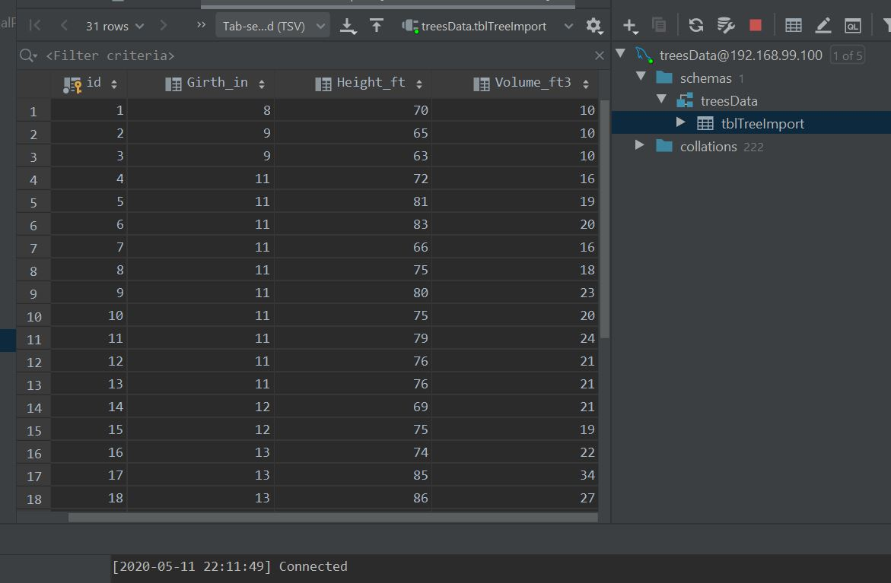
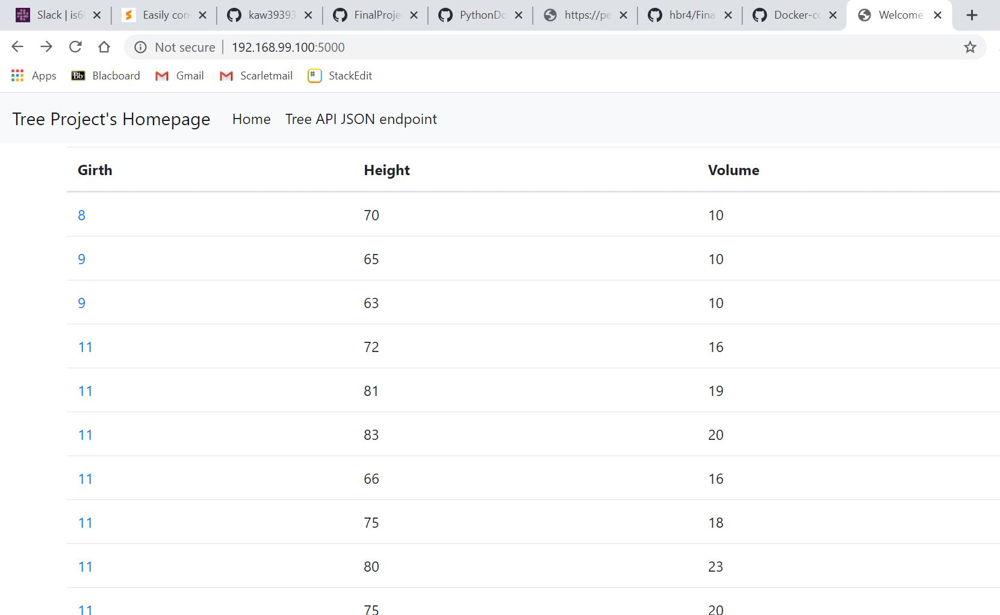
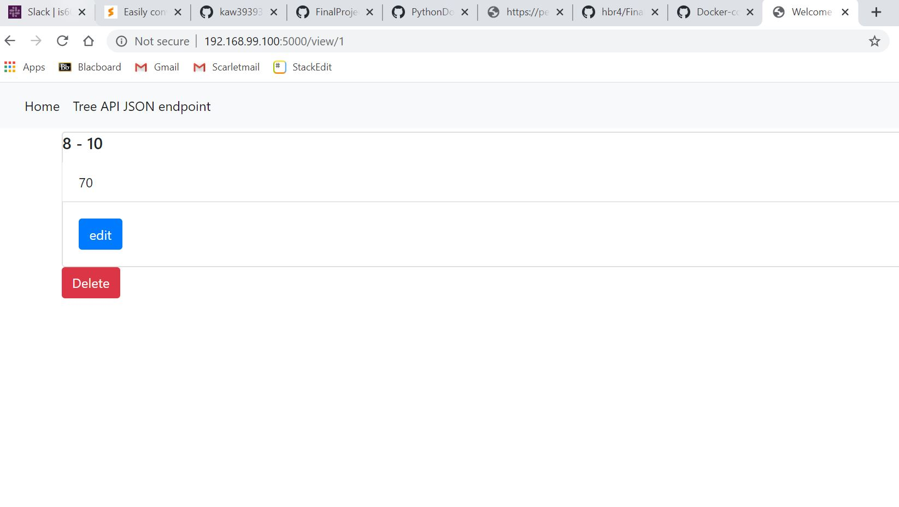
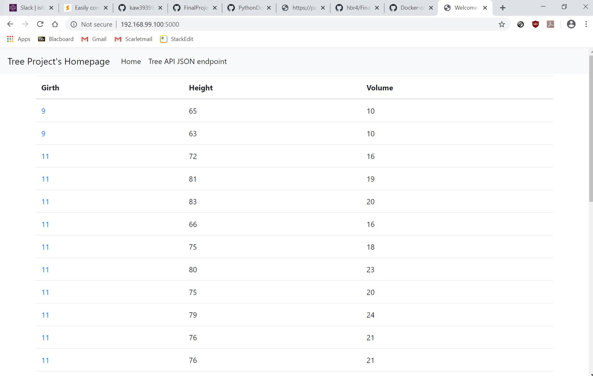
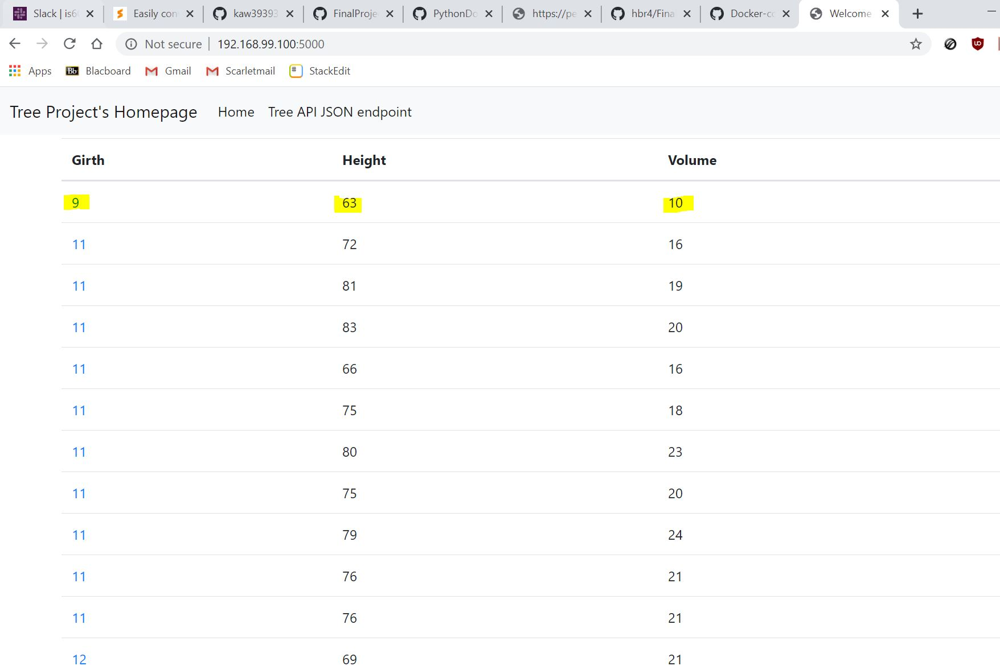
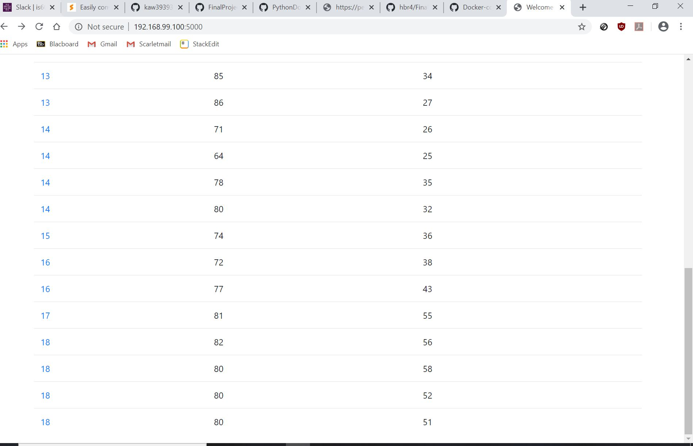

## Hiren Rana Final Project
In this assignment, we looked at how to create HTML forms to create new records, update records, and a small form that has no fields other than a submit button to delete records.
The below screenshots are used to show project completion per all required elements. For this project, the Trees CSV file was used with the Flask application.

Screenshot #1 - Data tables in pycharm

Screenshot #2 - Project running in the browser
The Dockerfile and Docker compose file was able to run as expected, and deployed successfully]

Screenshot #3 - View of One Record

Screenshot #4 - New record added

Screenshot #5 - Updated record

Screenshot #6 - Deleted record (note the last entry was deleted)
