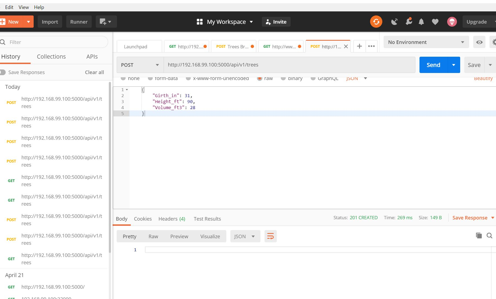
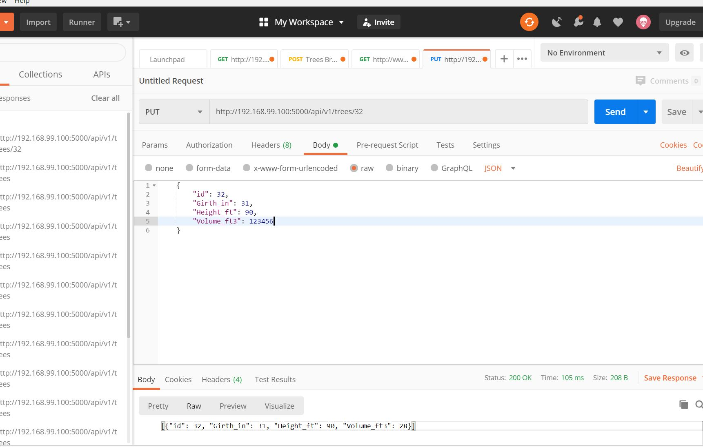

## Hiren Rana Final Project Part B
In Part B of the final project, we continued with our queries and utilized Postman for Rest APIs. For this project, the Trees CSV file was used with the Flask application.

Screenshot #1 - Postman POST Input

Screenshot #2 - Postman POST Output
This was the output of the Postman POST input. I accidently highlighted the incorrect line item. The POSTed line item was ID 32 (below the highlighted entry)

Screenshot #3 - Postman PUT Input

Screenshot #4 - Postman PUT Output
This was the output of the PUT command. Note the 123456 in Volume.

Screenshot #5 - Postman DELETE Input

Screenshot #6 - Postman DELETE Output
This was the output of the delete command. Note entry ID 32 was deleted from the list.
